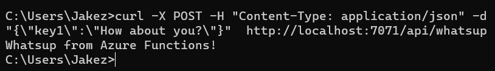

# A Beego Serverless Adapter for Azure Functions Deployment
This project aims to implement an adapter for web APIs based on Beego web framework in Go language for their serverless deployment on Azure Functions.
## Installation
Install [Go](https://go.dev/doc/install) dependencies.

Install [Beego](https://github.com/beego/beego), and [Bee](https://github.com/beego/bee).

Install [Azure Functions Core Tool](https://learn.microsoft.com/en-us/azure/azure-functions/functions-run-local?tabs=macos%2Cisolated-process%2Cnode-v4%2Cpython-v2%2Chttp-trigger%2Ccontainer-apps&pivots=programming-language-csharp).

## Running

After integrated with this adapter, there are still a little modification needs to be done on the source code, basically about the Controllers and Routers.

Add and setup the `routeInfo` to controllers, for example:
```
type MyController1 struct {
    web.Controller
    routeInfo map[string]string
}
Ctrl1.routeInfo["/api/hello"] = "Get"
```
Then modified the `Routers` to:
```
azfuncAdapter.HttpFuncsHandler(Ctrl1.routeInfo, Ctrl1, "MyController1")
```
Finally replace the `web.Run()` (or `beego.Run()` for web apps using earlier version of Beego framework) with (since APIs will run on serverless service, no need of running the server):
```
 azfuncAdapter.PortHandler(":8080")
```
Then, using `func init` command (after installed Azure Functions Core Tools) to initialize configuration `files host.json` and `local.setting`.json.

In the `host.json`, add `enableForwardingHttpRequest: true` in the `customHandler` section, that ensures the entire HTTP request, including headers, body, and other HTTP properties, is sent to the custom handler without any modifications or abstractions by the Azure Functions runtime. It is necessary for this project, since Azure Functions’ lack of native support for Go language. 

For each API, use command `func new -l Custom -t HttpTrigger -n <your API name> -a anonymous` to initialize the API. Argument `anonymous` avoid the authentication for this API, for cases need credential authentication on Azure, should replace the `anonymous` with `function`. 

To setup dependencies for the project, go mod should be initialized with: 
```
go mod init <your project name>
go mod tidy
```
Then build with `go build handler.go`. Before deploying web APIs to Azure Functions, they could first be validated in local environment with the help of Azure Functions Core Tools, using command `func start`. 

Before deployment, an Azure subscription, resource group and function app should be created. The function app should be configured aligning with this project, the arguments during the setup is `Deploy by code`, `Runtime Stack: Custom Handler`, `Version: custom`, `Operating System: Linux`. 

In the `Configuration` section of the Function App, do not forget to configure the Azure Storage for serverless code by setting `Connection String` to `AzureWebJobsStorage`, where the connection string can be find in `Storage` in the left navigation of Azure, select the storage account you want to use, and then click the `Manage Access Keys` button at the bottom of the page.

Then to run the Github Action workflow, a `AZURE_RBAC_CREDENTIALS` should be acquired though this command: 
```
az login
az ad sp create-for-rbac --name <your app name> --role administrator --scopes /subscriptions/<your subscription ID>/resourceGroups/<your resource group name>/providers/Microsoft.Web/sites/<your function app name> --sdk-auth
```
This credentials should be added to Github secret for the repository.

Finally, push the code to Github repository and the deployment should start.
## Testing
When deployed locally with Azure Functions Core Tools:


When accessing localhost:7071, this page indicates that this web app is successfully deployed locally:


When accessing the API hello and whatsup:


Since the API whatsup is configured for POST method, we shall sending a POST request using curl, then we have:


Now, we have validated the API deployment in local environment, after running the Github Action workflow, we shall see the CI/CD process in repository:


In Azure Portal (https://portal.azure.com/), we can find that the targeted Function App has new functions:


Through the given URL of the Function App, we can find that the Azure Functions app is online:


When accessing the deployed APIs, we have:


We can also monitor the invocation status of web APIs through Azure Function’s Monitoring:


